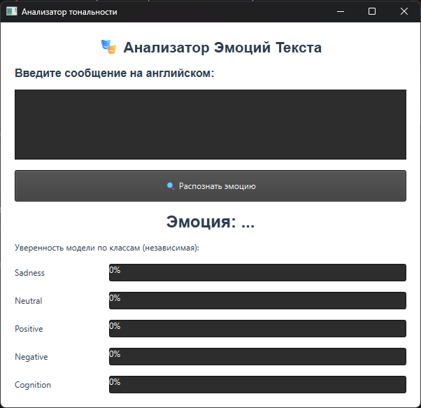
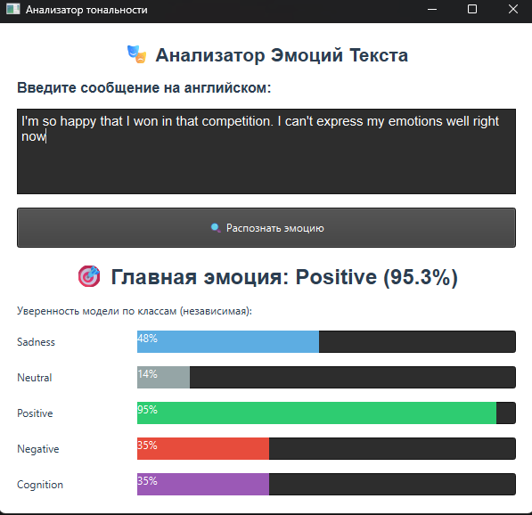
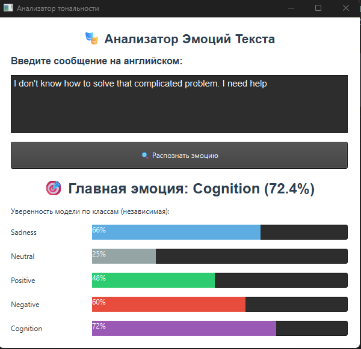
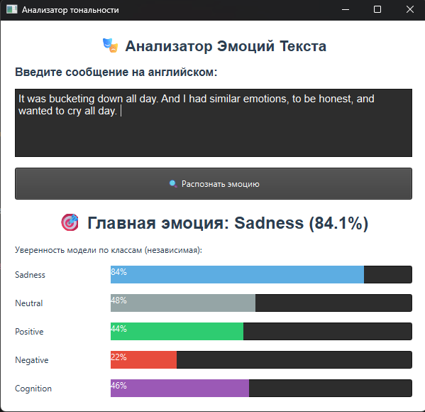

# Emotion Desktop App

Desktop-приложение для анализа эмоциональной окраски текста на английском языке.
Проект сочетает GUI на **PyQt6** и DL-модель на **PyTorch** (BiLSTM),
чтобы быстро получать вероятности по классам эмоций и итоговый прогноз.

## Состав команды
1. Лонишин Максим Русланович, группа 5130202/20201
2. Олейникова Анастасия Денисовна, группа 5130202/20201 
3. Пономарев Александр Антонович, группа 5130202/20201

## Датасет
1. [Go Emotions: Google Emotions Dataset](https://www.kaggle.com/datasets/shivamb/go-emotions-google-emotions-dataset/data)

## Что умеет приложение

- Принимать произвольный текст от пользователя.
- Определять наиболее вероятную эмоцию.
- Показывать уверенность по каждому классу через прогресс-бары.
- Работать локально (без web-сервера) как desktop-инструмент.

## Демонстрация

Главное окно:



Примеры предсказаний:





## Стек технологий

- Python
- PyTorch
- Transformers (BERT tokenizer)
- PyQt6
- NumPy

## Структура проекта

```text
dl_project_spbstu/
├── main.py                       # Точка входа (запуск GUI)
├── requirements.txt              # Зависимости
├── src/
│   ├── ui.py                     # Интерфейс и пайплайн инференса
│   ├── model_inference.py        # Класс модели BiLSTMClassifier
│   ├── text_processor.py         # Модуль для препроцессинга (заготовка)
│   └── models/                   # Веса, параметры и токенизатор
├── notebooks/                    # Исследования и обучение модели
└── demo/screenshots/             # Скриншоты приложения
```

## Как это работает

1. Пользователь вводит текст в `src/ui.py`.
2. Текст токенизируется через сохраненный BERT-токенизатор (`src/models/saved_tokenizer`).
3. Модель `BiLSTMClassifier` из `src/model_inference.py` получает токены и возвращает logits.
4. Для получения вероятностей применяется `sigmoid`, затем выбирается класс с максимальной уверенностью.
5. Интерфейс отображает главную эмоцию и вероятности по классам.

## Модель

- Архитектура: **BiLSTM + Attention + Linear head**.
- Параметры модели (например, `hidden_dim`, `num_layers`, `max_len`) загружаются из `src/models/model_params.pkl`.
- Веса загружаются из `src/models/best_emotion_model.pth`.

> Примечание: в текущем интерфейсе отображаются 5 классов (`Sadness`, `Neutral`, `Positive`, `Negative`, `Cognition`).

## Данные и ноутбуки

В папке `notebooks/` находятся эксперименты по анализу данных и обучению модели:

- `00_data_analysis.ipynb`
- `01_bi_lstm_model.ipynb`
- `02_improving_bi_lstm_results.ipynb`
- `03_improving_bi_lstm_results.ipynb`


## Лицензия
